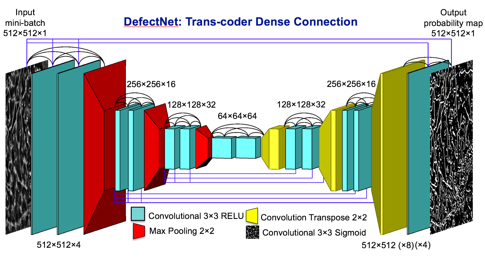

# Deep Learning for Semantic Segmentation of Defects in Advanced STEM Images of Steels
 
 This is an implementation of [DefectSegNet](https://www.nature.com/articles/s41598-019-49105-0)  on Python3, TensorFlow and Keras. The model identifies and segments defect features in neutron irradiated HT-9 steel. It has been trained on high-quality STEM images of HT-9 alloy and the images were acquired using an advanced [DCI-STEM](https://www.sciencedirect.com/science/article/pii/S0304399117305211?via%3Dihub).
  
**Disclaimer**: This model was trained and tested on micrographs of HT-9 alloys and in the imaging conditions noted below in "DCI STEM: Imaging Conditions". We cannot guarantee the same level of performance on other types of images.   

 The repository contains:
- Source code of DefectSegNet
- Pre-trained weights for DCI-STEM images
- Python file **segmentation.py** to test your own image
- Manual describing different terms and variables used throught DefectSegNet 

# Getting Started

[segmentation.py](segmentation.py) is the easiest way to start. It shows an example of using a model pre-trained on our DCI STEM images to segment defect features in your own images. It allows to run semantic segmentation on given images and particular defects like Precipitates, Voids and Dislocations.

1. Download or clone the repository.
2. Run "segmentation.py" using the following command. `python --image xxx.png --target void --output results/` . It allows you to run DefectSegNet on your image and specific defect (target).
    - Set the value after `--image` to the one that is to be tested.
    - Set the value after `--target` variable to the defect that is to be identified in the image.[prec (precipitates), void, disloc           (dislocations)]
    - Set the value after `--output` to the folder you want to store the results in. Default is 'results/'
4. Resulting segmented image can be viewed using `view_csv.py` using the command. `python xxx.csv --threshold 0.5`
    - The threshold value can be set explicitly between 0 and 1.
 
**Note: The model was trained on our own dataset. The performance might vary depending on the imaging conditions and the type of the sample.**

# Requirements
Python 3.3, TensorFlow r1.14, scikit-learn and other common packages listed in [requirements.txt](requirements.txt).

# DCI STEM: Imaging Conditions 
The DCI STEM imaging was performed using a JEOL ARM200CF microscope operated at 200kV, with a convergence semi-angle of 6.2 mrad and bright-field collection angle of 9 mrad. To balance field-of-view size and pixel resolution, a magnification of 250,000x and a 2048x2048 pixels image size (i.e. *a pixel size of 3.2nm/pixel*) along with a dwell time of 16µs was used to acquire all DCI STEM images.

For imaging dislocations, the commonly used systematic row diffraction condition was satisfied by tilting a TEM sample of pristine HT-9 steel away from [001] zone axis to approximately 1g011 on Bragg condition. The line dislocations in this BCC crystal were identified as the ½〈111〉{111} dislocation. Moreover, optimal defect contrast for precipitates and voids can be achieved by slightly tilting the TEM sample (about 2 to 4 degrees) of the systematic row diffraction condition until there are no strongly excited diffractions. For details on the DCI STEM imaging method and TEM sample preparations, one may refer to our previous [study](https://www.sciencedirect.com/science/article/pii/S0304399117305211?via%3Dihub) .

# DefectSegNet Architecture
The DefectSegNet architecture, shown in figure below, consists of a total of 19 hidden layers. On the encoder side, max pooling is performed after each dense block, enabling the succeeding block to extract higher level, more contextual (and abstract) features from the defect images. For the decoder, to recover the resolution we employed the transposed convolutions, a more sophisticated operator than bilinear interpolation, for up-sampling. There are equal numbers of max pooling layers and transposed convolution layers, so the output probability map has the same spatial resolution as the input image. For the design of skip connections, besides those already introduced in dense blocks, feature maps created during encoding are input to all the decoder layers of the same spatial resolution. This allows the feature maps of a certain spatial resolution to connect cross the encoder-decoder performing in a similar manner to a single dense block. The incorporation of these skip connections both within and across blocks is the primary diference between our DefectSegNet and the U-Net36 and the fully convolutional DenseNet38. Lastly, the final hidden layer is a 3×3 convolutional layer with a sigmoid activation function for classification.

 

# Dataset and Image Augmentation

DefectSegNet has been trained using various data augmentation methods. As demonstrated in figure below, a full 2048×2048 pixels image was divided into five regions, including three training subsets (each 1024×1024 pixels), and one development set and one test set (each 1024×512 pixels). Then, each training subset was augmented by rotation (i.e. 90°, 180°, and 270° clockwise) and by horizontal flipping each rotated image. The development sets and testing sets are not augmented. In all, two original 2048×2048 pixels micrograph/label sets are augmented to produce 48 1024×1024 pixels training image and label pairs used for the training of deep CNN models for defect semantic segmentation.

# References
G.Roberts, S. Y. Haile, R.Sainju, D. J. Edwards, B.Hutchinson and Y.Zhu*, Deep Learning for Semantic Segmentation of Defects in Advanced STEM Images of Steels, Scientific Reports 9, 12744 (2019).
